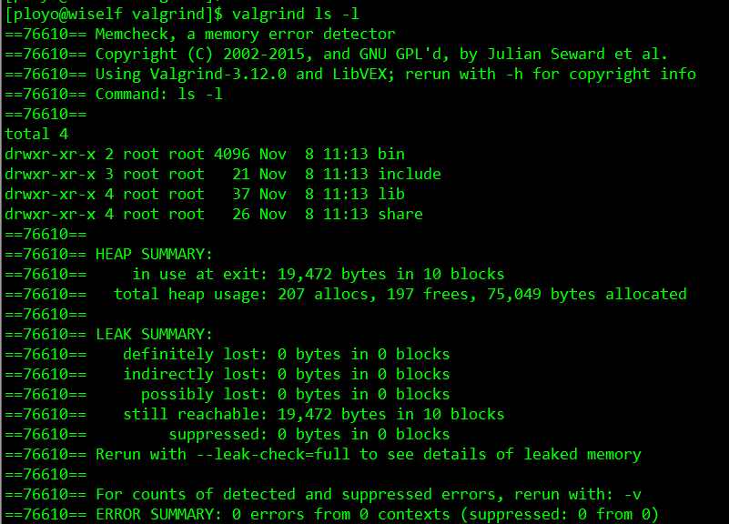

## Valgrind
### Valgrind-3.12.0编译安装  
系统编程中一个重要的方面就是有效地处理与内存相关的问题。工作越接近系统，就需要面对越多的内存问题。有时这些问题非常琐碎，而更多时候它会演变成一个调试内存问题的恶梦。所以，在实践中会用到很多工具来调试内存问题。  
此处，我们将讨论最流行的开源内存管理框架 VALGRIND。  
```
摘自 Valgrind.org：  

Valgrind是用于构建动态分析工具的探测框架。它包括一个工具集，每个工具执行某种类型的调试、分析或类似的任务，以帮助完善你的程序。Valgrind的架构是模块化的，所以可以容易地创建新的工具而又不会扰乱现有的结构。  
```  

许多有用的工具被作为标准而提供。  
* Memcheck是一个内存错误检测器。用于检查程序中的内存问题，如泄漏、越界、非法指针等它有助于使你的程序，尤其是那些用C和C++写的程序，更加准确。  
* Cachegrind是一个缓存和分支预测分析器。用于分析CPU的cache命中率、丢失率，用于进行代码优化。它有助于使你的程序运行更快。  
* Callgrind是一个调用图缓存生成分析器。用于检测程序代码的运行时间和调用过程，以及分析程序性能。它与Cachegrind的功能有重叠，但也收集Cachegrind不收集的一些信息。  
* Helgrind是一个线程错误检测器。用于检查多线程程序的竞态条件。它有助于使你的多线程程序更加准确。  
* DRD也是一个线程错误检测器。它和Helgrind相似，但使用不同的分析技术，所以可能找到不同的问题。  
* Massif是一个堆分析器。指示程序中使用了多少堆内存等信息。它有助于使你的程序使用更少的内存。  
* DHAT是另一种不同的堆分析器。它有助于理解块的生命期、块的使用和布局的低效等问题。  
* SGcheck是一个实验工具，用来检测堆和全局数组的溢出。它的功能和Memcheck互补：SGcheck找到Memcheck无法找到的问题，反之亦然。  
* BBV是个实验性质的SimPoint基本块矢量生成器。它对于进行计算机架构的研究和开发很有用处。  

也有一些对大多数用户没有用的小工具：Lackey是演示仪器基础的示例工具；Nulgrind是一个最小化的Valgrind工具，不做分析或者操作，仅用于测试目的。  

#### 下载  
直接下载源码包。  
```
$ wget http://valgrind.org/downloads/valgrind-3.12.0.tar.bz2 
$ tar -xjvf valgrind-3.12.0.tar.bz2  
$ cd valgrind-3.12.0  
```  

#### 生成Makefile并使用它进行编译  
生成Makefile的步骤在README这个文件中有写。  

* 运行./autogen.sh来设置环境（你需要标准的autoconf工具）  
  这个脚本其实是调用的aclocal autoheader automake autoconf，所以必须先安装好它，如果没有安装，在运行这个脚本的时候会提示你的。  
* 运行./configure来生成Makefile文件  
  这里你可以使用./configure --help来查看可以使用哪些参数设置。  
  一般设置好安装路径即可./configure --prefix=/usr/local/valgrind  
* 运行make进行编译，运行make install进行安装。  

#### 测试安装是否成功  
编译完成之后可以测试一下。  
因为上面编译安装的时候指定了安装目录，所以还需要把valgrind的bin目录路径添加到环境变量PATH中。否则只能使用全路径来运行valgrind。  
这里我把它写入到~/.bashrc文件中。打开~/.bashrc文件，然后在最后添加一行PATH=${PATH}:/usr/local/valgrind/bin，之后使用source ~/.bashrc来更新一下。
使用命令valgrind ls -l 进行测试    
  

### 使用Valgrind Memcheck  
memcheck工具的使用方式如下:  
```
$ valgrind --tool=memcheck ./a.out
```  

从上面的命令可以清楚的看到, 主要的命令是valgrind，而我们想使用的工具是通过'-tool'选项来指定的. 上面的‘a.out’指的是我们想使用memcheck运行的可执行文件。  
该工具可以检测下列与内存相关的问题 :  
* 未释放内存的使用  
* 对释放后内存的读/写  
* 对已分配内存块尾部的读/写  
* 内存泄露  
* 不匹配的使用malloc/new/new[] 和 free/delete/delete[]  
* 重复释放内存  

注意：上面列出的并不很全面，但却包含了能被该工具检测到的很多普遍的问题。  
注意：使用gcc并且加上-g选项可以在memcheck的输出中生成行号。  


### 参考  
1. [如何使用Valgrind memcheck工具进行C/C++的内存泄漏检测](http://blog.csdn.net/jkh753/article/details/12776341)  
2. [linux下利用valgrind工具进行内存泄露检测和性能分析](http://blog.csdn.net/sunmenggmail/article/details/10543483)  
3. [Journey of a C Program to Linux Executable in 4 Stages](http://www.thegeekstuff.com/2011/10/c-program-to-an-executable/)  