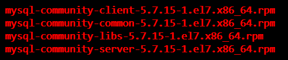
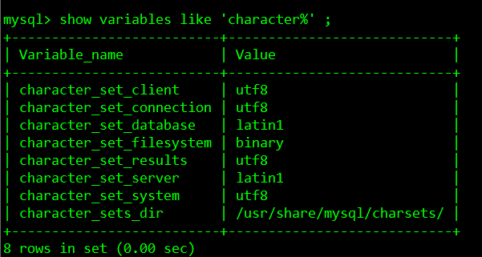

## Linux安装MySQL
### 下载安装包
***  
下载链接： [http://dev.mysql.com/downloads/mysql/](http://dev.mysql.com/downloads/mysql/)
此处仅需下载适配RHEL7的mysql5.7.15服务端与客户端安装包：
```
mysql-community-server-5.7.15-1.el7.x86_64.rpm  
mysql-community-client-5.7.15-1.el7.x86_64.rpm  
```

### 安装MySQL
***  
#### 安装说明
1. MySQL的安装包有很多个，作用也不同，在大多数情况下，只需要安装MySQL-server 和 MySQL-client，其他的包根据需要来安装。    
2. The server RPM places data under the /var/lib/mysql directory. The RPM also creates a login account for a user named mysql (if one does not exist) to use for running the MySQL server, and creates the appropriate entries in /etc/init.d/ to start the server automatically at boot time. (This means that if you have performed a previous installation and have made changes to its startup script,you may want to make a copy of the script so that you do not lose it when you install a newer RPM.)   
3. During RPM installation, a user named mysql and a group named mysql are created on the system. This is done using the useradd, groupadd,and usermod commands. Those commands require appropriate administrative privileges, which is required for locally managed users and groups (as listed in the /etc/passwd and /etc/group files) by the RPM installation process being run by root.在MySQL 安装时，会创建mysql 用户和mysql组。    
4. MySQL 的相关目录说明： 
   
```
* /usr/bin ：	Client programs and scripts    -- mysqladmin, mysqldump等命令  
* /usr/sbin：　	The mysqld server  
* /var/lib/mysql：	Log files, databases  --这个目录就是数据库的目录  
* /usr/share/info：	Manual in Info format  
* /usr/share/man：	Unix manual pages  
* /usr/include/mysql：	Include (header) files  
* /usr/lib/mysql：		Libraries  
* /usr/share/mysql　：　Miscellaneous support files,including error messages,character set files, sample configuration files, SQLfor database installation   --mysql.server命令及配置文件  
* /usr/share/sql-bench：　Benchmarks  
* /etc/rc.d/init.d/: 启动脚本文件mysql的目录  
```

#### 安装  
将下载的安装包拷贝至/home/mysql目录下,  
  
依次安装:   
```
$ sudo rpm -ivh mysql-community-common-5.7.15-1.el7.x86_64.rpm   
$ sudo rpm -ivh mysql-community-libs-5.7.15-1.el7.x86_64.rpm  
$ sudo rpm -ivh mysql-community-client-5.7.15-1.el7.x86_64.rpm  
$ sudo rpm -ivh mysql-community-server-5.7.15-1.el7.x86_64.rpm  
```

安装好后需要为MySQL的root用户设置密码，  
```
$ sudo systemctl start mysqld  //启动MySQL  
$ sudo mysql_secure_installation  //MySQL安装配置向导
```

在使用mysql_secure_installation进行安全配置向导过程中，会执行以下几个过程与设置：
1. 键入当前用户密码(初次root运行直接回车)
2. 为root用户设置密码  
3. 删除匿名账号(生成环境建议删除)  
4. 取消root用户远程登录  
5. 删除test库和test库的访问权限  
6. 刷新授权表使修改生效  

设置密码也可用以下命令(不建议，建议使用mysql_secure_installation)：
```
$ sudo /usr/bin/mysqladmin -u root password'new-password'
$ sudo /usr/bin/mysqladmin -u root -h rac2password 'new-password'
```

若发现错误：ERROR!The server quit without updating PID file
可能是由于selinux未关闭的缘故，因此解决方法是关闭它，打开/etc/selinux/config，把SELINUX=enforcing改为SELINUX=disabled后存盘退出重启机器。  

### 使用MySQL  
***  
#### Root登录  
使用以下命令进行登录：  
```
mysql -u root -p  //会提示输入密码  
```

#### 创建新用户和数据库  
以下例子以xdr为数据库名，以userxdr为用户名，以passwdxdr为密码： 
```
create database xdr;  
create user 'userxdr'@'localhost' identified by 'passwdxdr';  
grant all on xdr.* to 'userxdr' identified by 'passwdxdr';  
```

如果在执行create user过程中报错"Unknown column 'password_last_changed' in 'mysql.user'",则在退出mysql后执行以下命令：  
```
$ sudo mysql_upgrade -u root -p  
$ sudo systemctl restart mysqld  
```

#### 创建表  
使用上面创建的用户及数据库：  
```
$ mysql -u userxdr -p  //键入密码passwdxdr
$ use xdr;
$ create table bablename (...) ;
```

#### 重置MySQL的root密码  
忘记root密码时：  
1. 停止当前的MySQL进程，并以安全模式重启  
```
$ sudo systemctl stop mysqld  
$ sudo mysqld_safe --skip-grant-tables &
```

2. 重新连接到MySQL的root账户  
```
$ mysql -u root
```

3. 重置密码  
```
> use mysql ;
> update user SET PASSWORD=PASSWORD("password") WHERE USER='root' ;
> flush privileges ;
> exit
```

4. 重启MySQL  
```
$ sudo systemctl restart mysqld 
```

### 安装后设置  
***  
#### 查看MySQL端口3306，这个是默认端口  
```
$ netstat -nat|grep 3306
```

#### 设置MySQL远程连接  
1. 查看MySQL的用户。使用root账户登录，并切换至mysql数据下，  
```
> select host,user from mysql.user;
```

2. 设置允许所有地址访问：  
```
> update mysql.user set host='%' where user='root' ;
> FLUSH PRIVILEGES ;
```

3. 设置3306端口允许访问：  
要访问3306可以用两种方式，一个就是让防火墙开放3306端口，另一个是关闭防火墙。推荐使用开放3306端口。
开放3306端口：  
* 方法一：  
```
$ iptables -I INPUT -i eth0 -p tcp --dport 3306 -j ACCEPT  
$ iptables -I OUTPUT -o eth0 -p tcp --sport 3306 -j ACCEPT  
```
对应阻止3306端口的命令为，  
```
$ iptables -I INPUT -i eth0 -p tcp --dport 3306 -j DROP  
$ iptables -I OUTPUT -o eth0 -p tcp --sport 3306 -j DROP
```
然后保存，
```
$ /etc/rc.d/init.d/iptables save  
```

* 方法二：  
修改/etc/sysconfig/iptables文件，增加如下一行：  
```
-A RH-Firewall-1-INPUT -m state --state NEW -m tcp -p tcp --dport 3306 -j ACCEPT
```
然后重启防火墙，  
```
$ service iptables restart  
```
关闭防火墙：  
* 方法一：  
```
$ chkconfig iptables off        （ 对应的开启防火墙命令为：chkconfig iptables on ）
```
* 方法二：  
```
$ service iptables stop        （ 对应的开启防火墙命令为：service iptables start ）
```

#### 设置MySQL不区分大小写  
Linux下的mysql安装完之后默认：区分表名的大小写，不区分列名的大小写。  
改变表名的大小写区分规则的方法：用root帐号登录，在/etc/my.cnf 或 /etc/mysql/my.cnf 中的[mysqld]后添加lower_case_table_names=1，重启MySQL服务，若设置成功，则不再区分表名的大小写。
##### 注意
```
如果在/etc或/etc/mysql找不到my.cnf ，需要从其他地方拷贝过来，因为使用rpm安装mysql时，需要手工拷贝my.cnf。具体操作： 到/usr/share/mysql/下找到*.cnf文件，拷贝其中一个到/etc/并改名为my.cnf。  
my-small.cnf是为了小型数据库而设计的。不应该把这个模型用于含有一些常用项目的数据库。  
my-medium.cnf是为中等规模的数据库而设计的。  
my-large.cnf是为专用于一个SQL数据库的计算机而设计的。  
my-huge.cnf是为企业中的数据库而设计的。  
```

#### 修改MySQL默认编码  
mysql数据库的默认编码并不是utf-8。  
安装mysql后，启动服务并登陆，使用 "show variables like 'character%';" 命令可查看mysql数据库的默认编码:   
  
由上图可见database和server的字符集使用了latin1编码方式，不支持中文，即存储中文时会出现乱码。以下是命令行修改为utf-8编码的过程，以支持中文。  
1. 关闭MySQL服务  
```
$ sudo systemctl stop mysqld  
```

2. 开my.cnf后，在文件内的[mysqld]下增加如下两行设置，并保存退出:  
```
character_set_server=utf8  
init_connect='SET NAMES utf8'  
```

3. 重启MySQL服务  

#### 设置开机自启动  
1. 方法一：
开机自启动，  
```
$ sudo systemctl enable mysqld  
```
关闭自启动，  
```
$ sudo systemctl disable mysqld  
```

2. 方法二：  
查看MySQL开机自启动设置,  
```
$ chkconfig --list|grep mysql  
```
开机自启动，  
```
$ sudo chkconfig mysql on  
```
关闭自启动，  
```
$ sudo chkconfig mysql off
```
将MySQL从chkconfig服务里删除,    
```
$ sudo chkconfig --del mysql  
```
将MySQL添加到chkconfig里,  
```
$ sudo chkconfig --add mysql  
```

