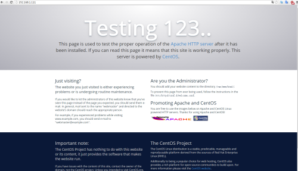
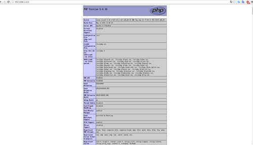

##CentOS 7.0安装配置LAMP服务器(Apache+PHP+MariaDB)
CentOS 7.0默认使用的是firewall作为防火墙，这里改为iptables防火墙。  
### 关闭firewall
```
$ sudo systemctl stop firewalld.service     #停止firewall
$ sudo systemctl disable firewalld.service  #禁止firewall开机启动
```

### 安装iptables防火墙  
```
$ sudo yum install iptables-services    #安装  
$ sudo vim /etc/sysconfig/iptables      #编辑防火墙配置文件  
# Firewall configuration written by system-config-firewall  
# Manual customization of this file is not recommended.  
*filter  
:INPUT ACCEPT [0:0]  
:FORWARD ACCEPT [0:0]  
:OUTPUT ACCEPT [0:0]  
-A INPUT -m state --state ESTABLISHED,RELATED -j ACCEPT  
-A INPUT -p icmp -j ACCEPT  
-A INPUT -i lo -j ACCEPT  
-A INPUT -m state --state NEW -m tcp -p tcp --dport 22 -j ACCEPT  
-A INPUT -m state --state NEW -m tcp -p tcp --dport 80 -j ACCEPT  
-A INPUT -m state --state NEW -m tcp -p tcp --dport 3306 -j ACCEPT  
-A INPUT -j REJECT --reject-with icmp-host-prohibited  
-A FORWARD -j REJECT --reject-with icmp-host-prohibited  
COMMIT  
$ sudo systemctl restart iptables.service      #最后重启防火墙使配置生效  
$ sudo systemctl enable iptables.service       #设置防火墙开机启动  
```

### 关闭SELINUX  
```
$ sudo vim /etc/selinux/config  
#SELINUX=enforcing     #注释掉  
#SELINUXTYPE=targeted  #注释掉  
SELINUX=disabled       #增加  
$ sudo setenforce 0    #使配置生效
```

### 安装Apache  
```
$ sudo yum install httpd                 #根据提示，输入Y安装即可成功安装  
$ sudo systemctl start httpd.service     #启动apache  
$ sudo systemctl stop httpd.service      #停止apache  
$ sudo systemctl restart httpd.service   #重启apache  
$ sudo systemctl enable httpd.service    #设置apache开机启动  
```

在客户端浏览器中打开服务器IP地址，会出现下面的界面，说明apache安装成功  


### 安装MariaDB
1. 安装MariaDB  
```
$ sudo yum install mariadb mariadb-server               #询问是否要安装，输入Y即可自动安装,直到安装完成
$ sudo systemctl start mariadb.service                  #启动MariaDB
$ sudo systemctl stop mariadb.service                   #停止MariaDB
$ sudo systemctl restart mariadb.service                #重启MariaDB
$ sudo systemctl enable mariadb.service                 #设置开机启动
$ sudo cp /usr/share/mysql/my-huge.cnf /etc/my.cnf      #拷贝配置文件（注意：如果/etc目录下面默认有一个my.cnf，直接覆盖即可）
```

2. 为root账户设置密码  
```
$ mysql_secure_installation  
```
回车，根据提示输入Y  
输入2次密码，回车  
根据提示一路输入Y  
最后出现：Thanks for using MySQL!  
MariaDB密码设置完成，重新启动 MariaDB：  
```
$ sudo systemctl restart mariadb.service #重启MariaDB  
```

### 安装PHP  
1. 安装PHP  
```
$ sudo yum install php php-devel -y
```

2. 安装PHP组件，使PHP支持MariaDB  
```
$ sudo yum install php-mysql php-gd libjpeg* php-ldap php-odbc php-pear php-xml php-xmlrpc php-mbstring php-bcmath php-mhash -y
$ sudo systemctl restart mariadb.service
$ sudo systemctl restart httpd.service
```

### 配置篇
#### Apache配置  
```
$ sudo vim /etc/httpd/conf/httpd.conf #编辑文件
ServerSignature On  #添加，在错误页中显示Apache的版本，Off为不显示
Options Indexes FollowSymLinks  #修改为：Options Includes ExecCGI FollowSymLinks（允许服务器执行CGI及SSI，禁止列出目录）
#AddHandler cgi-script .cgi　#修改为：AddHandler cgi-script .cgi .pl （允许扩展名为.pl的CGI脚本运行）
AllowOverride None　 #修改为：AllowOverride All （允许.htaccess）
AddDefaultCharset UTF-8　#修改为：AddDefaultCharset GB2312　（添加GB2312为默认编码）
#Options Indexes FollowSymLinks   #修改为 Options FollowSymLinks（不在浏览器上显示树状目录结构）
DirectoryIndex index.html   #修改为：DirectoryIndex index.html index.htm Default.html Default.htm index.php（设置默认首页文件，增加index.php）
MaxKeepAliveRequests 500  #添加MaxKeepAliveRequests 500 （增加同时连接数）
$ sudo systemctl restart httpd.service #重启apache
$ sudo rm -f /etc/httpd/conf.d/welcome.conf /var/www/error/noindex.html #删除默认测试页
```

#### PHP配置  
```
$ sudo vim /etc/php.ini #编辑
date.timezone = PRC #把前面的分号去掉，改为date.timezone = PRC
disable_functions = passthru,exec,system,chroot,scandir,chgrp,chown,shell_exec,proc_open,proc_get_status,ini_alter,ini_alter,ini_restore,dl,openlog,syslog,readlink,symlink,popepassthru,stream_socket_server,escapeshellcmd,dll,popen,disk_free_space,checkdnsrr,checkdnsrr,getservbyname,getservbyport,disk_total_space,posix_ctermid,posix_get_last_error,posix_getcwd, posix_getegid,posix_geteuid,posix_getgid, posix_getgrgid,posix_getgrnam,posix_getgroups,posix_getlogin,posix_getpgid,posix_getpgrp,posix_getpid, posix_getppid,posix_getpwnam,posix_getpwuid, posix_getrlimit, posix_getsid,posix_getuid,posix_isatty, posix_kill,posix_mkfifo,posix_setegid,posix_seteuid,posix_setgid, posix_setpgid,posix_setsid,posix_setuid,posix_strerror,posix_times,posix_ttyname,posix_uname
#列出PHP可以禁用的函数，如果某些程序需要用到这个函数，可以删除，取消禁用。
expose_php = Off #禁止显示php版本的信息
short_open_tag = ON #支持php短标签
open_basedir = .:/tmp/  #设置表示允许访问当前目录(即PHP脚本文件所在之目录)和/tmp/目录,可以防止php木马跨站,如果改了之后安装程序有问题(例如：织梦内容管理系统)，可以注销此行，或者直接写上程序的目录/data/www.osyunwei.com/:/tmp/
$ sudo systemctl restart mariadb.service #重启MariaDB
$ sudo systemctl restart httpd.service #重启apache
```

#### 测试篇  
```
$ cd /var/www/html
$ vim index.php
<?php
phpinfo() ;
?>
```

在客户端浏览器输入服务器IP地址，可以看到如下图所示相关的配置信息！


#### 注意：apache默认的程序目录是/var/www/html